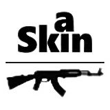
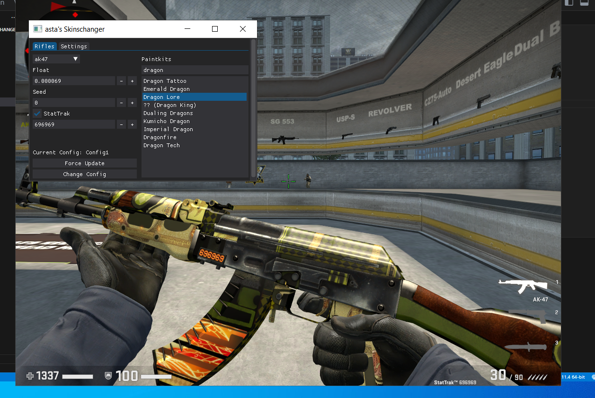
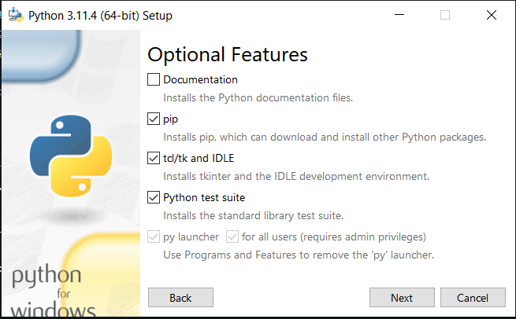

#The readme is UNFINISHED
<!-- PROJECT LOGO -->
<br />
<div align="center">
  <a href="https://github.com/F4sta/asta_SkinChanger">

  

  </a>

  <h3 align="center">Asta's Skinchanger</h3>

  <p align="center">
    CS:GO Skinchanger made by asta with Python 3.11
    <br />
    Readme made with otheneildrew's template
    <br />
    <br />
    <a href="">View Demo</a>
    ·
    <a href="https://github.com/F4sta/aStaKins/issues">Report Bug</a>
    ·
    <a href="https://github.com/F4sta/aStaKins/issues">Request Feature</a>
  </p>
</div>


<!-- TABLE OF CONTENTS -->
<details>
  <summary>Table of Contents</summary>
  <ol>
    <li>
      <a href="#about-the-project">About The Project</a>
      <ul>
        <li><a href="#built-with">Built With</a></li>
      </ul>
    </li>
    <li>
      <a href="#getting-started">Getting Started</a>
      <ul>
        <li><a href="#prerequisites">Prerequisites</a></li>
        <li><a href="#installation">Installation</a></li>
      </ul>
    </li>
    <li><a href="#usage">Usage</a></li>
    <li><a href="#license">License</a></li>
    <li><a href="#about-me">About Me</a></li>
    <li><a href="#contact">Contact</a></li>
    <li><a href="#acknowledgments">Acknowledgments</a></li>
  </ol>
</details>


<!-- ABOUT THE PROJECT -->
## About The Project

<p align="center">Ak47 - Dragon Lore</p>
<p align="center">The skinchanger let you use any skin on any weapon, but not every one of them work well!</p>
<p align="center"></img></p>

My skinchager is translated from a c++ cheat that made by youtuber cazz into python. The cheat is work with R/W (Read/Write), this method changes memory values in csgo. The cheat was writen in python 3.11 . After csgo update the skinchanger may not work because everytime the csgo updates the offsets we work with are changes, it will only work if the offsets is up to date.

* Offsets from Hazedumper github page
* Ui made with DearPyGui alias the python version of Imgui
* External cheat, no needed injection
* Live update config file
* Live update skins/paintkits

<h3> What does R/W stands for in proggraming? </h3>

In programming, "R/W" stands for "Read/Write." It refers to the capability of a variable, file, or memory location to be both read from (accessed) and written to (modified or updated). It is a fundamental concept in computer programming and plays a crucial role in manipulating data and maintaining state in programs.


<h3> What is an offset? </h3>

In computing and programming, an offset refers to a displacement or shift from a reference point. It is used to locate or access data in memory or within data structures. 


<h3> What is an External cheat? </h3>

These cheats are called "external" because they run outside the game's official code and are typically created by external developers who reverse-engineer the game or exploit vulnerabilities to gain an advantage. External cheats are considered unethical and are often in violation of the game's terms of service. Their usage can lead to negative consequences, such as being banned from the game or the game's online services.


<p align="right">(<a href="#readme-top">back to top</a>)</p>


### Built With

1.  Python 3.11.4 [download](https://www.python.org/downloads/release/python-3114)
2. Libraries:
    * [DearPyGui](https://github.com/hoffstadt/DearPyGui)
    * [ConfigParser](https://pypi.org/project/configparser/)
    * [Pymem](https://pypi.org/project/Pymem/)
    * [Json](https://docs.python.org/3/library/json.html#)
    * [Requests](https://pypi.org/project/requests/)

<p align="right">(<a href="#readme-top">back to top</a>)</p>


<!-- GETTING STARTED -->
## Getting Started

This field will be filled when all the file sorted in folders.

### Prerequisites

Windows:
  * Download Python 3.11, and install in customize installation, check all as below:


</br>


### Installation

1. Install all python library:
   ```bash
   pip install -r requirements.txt
   ```
3. Set steam location in SkinFolder.cfg in format as below (example: default folder):
   ```
   C:\Program Files (x86)\Steam
   ```
4. Run main,py
   ```bash
   py main.py
   ```
</br>
On run it will create/update :

  * offsets.py
  * skin_dict.json

</br>
If the command line doesn't recognize "py" launcher then you should modify your python installation and add py launcher.

If you have another python version already installed then use:
  *  ```bash
     py -3.11 pip install -r requirements.txt
     ```
  *  ```bash
     py -3.11 main.py
     ```


<p align="right">(<a href="#readme-top">back to top</a>)</p>


<!-- USAGE EXAMPLES -->
## Usage

Will have video for usage when i finish the ui :)

<p align="right">(<a href="#readme-top">back to top</a>)</p>


<!-- LICENSE -->
## License

Distributed under the MIT License. See `LICENSE.txt` for more information.

<p align="right">(<a href="#readme-top">back to top</a>)</p>


<!-- ABOUTME -->
## About Me

Name: Asta

  * Age: 17
  * Intrests: Programming, Games
  * Main Language: Python and Hungarian (:

<p align="right">(<a href="#readme-top">back to top</a>)</p>


<!-- CONTACT -->
## Contact

Steam   : [asta](https://steamcommunity.com/id/asta_locsos)

Discord : Krist..

Project Link: [https://github.com/F4sta/asta_SkinChanger](https://github.com/F4sta/asta_SkinChanger)

<p align="right">(<a href="#readme-top">back to top</a>)</p>


<!-- ACKNOWLEDGMENTS -->
## Acknowledgments

Use this space to list resources you find helpful and would like to give credit to. I've included a few of my favorites to kick things off!

* [Cazz's Video - C++ Skin changer](https://choosealicense.com)
* [Cazz's Github](https://github.com/cazzwastaken)
* [Othneildrew's template](https://github.com/othneildrew/Best-README-Template)
* [DearPyGui official Guide Video](https://youtube.com/playlist?list=PLcqt7R3y3elGh7zoj1-oyygzTh9j81hKV)

<p align="right">(<a href="#readme-top">back to top</a>)</p>


<!-- MARKDOWN LINKS & IMAGES -->
<!-- https://www.markdownguide.org/basic-syntax/#reference-style-links -->
[contributors-shield]: https://img.shields.io/github/contributors/othneildrew/Best-README-Template.svg?style=for-the-badge
[contributors-url]: https://github.com/othneildrew/Best-README-Template/graphs/contributors
[forks-shield]: https://img.shields.io/github/forks/othneildrew/Best-README-Template.svg?style=for-the-badge
[forks-url]: https://github.com/othneildrew/Best-README-Template/network/members
[stars-shield]: https://img.shields.io/github/stars/othneildrew/Best-README-Template.svg?style=for-the-badge
[stars-url]: https://github.com/othneildrew/Best-README-Template/stargazers
[issues-shield]: https://img.shields.io/github/issues/othneildrew/Best-README-Template.svg?style=for-the-badge
[issues-url]: https://github.com/othneildrew/Best-README-Template/issues
[license-shield]: https://img.shields.io/github/license/othneildrew/Best-README-Template.svg?style=for-the-badge
[license-url]: https://github.com/othneildrew/Best-README-Template/blob/master/LICENSE.txt
[linkedin-shield]: https://img.shields.io/badge/-LinkedIn-black.svg?style=for-the-badge&logo=linkedin&colorB=555
[linkedin-url]: https://linkedin.com/in/othneildrew
[product-screenshot]: Images/reference_image.png
[Next.js]: https://img.shields.io/badge/next.js-000000?style=for-the-badge&logo=nextdotjs&logoColor=white
[Next-url]: https://nextjs.org/
[React.js]: https://img.shields.io/badge/React-20232A?style=for-the-badge&logo=react&logoColor=61DAFB
[React-url]: https://reactjs.org/
[Vue.js]: https://img.shields.io/badge/Vue.js-35495E?style=for-the-badge&logo=vuedotjs&logoColor=4FC08D
[Vue-url]: https://vuejs.org/
[Angular.io]: https://img.shields.io/badge/Angular-DD0031?style=for-the-badge&logo=angular&logoColor=white
[Angular-url]: https://angular.io/
[Svelte.dev]: https://img.shields.io/badge/Svelte-4A4A55?style=for-the-badge&logo=svelte&logoColor=FF3E00
[Svelte-url]: https://svelte.dev/
[Laravel.com]: https://img.shields.io/badge/Laravel-FF2D20?style=for-the-badge&logo=laravel&logoColor=white
[Laravel-url]: https://laravel.com
[Bootstrap.com]: https://img.shields.io/badge/Bootstrap-563D7C?style=for-the-badge&logo=bootstrap&logoColor=white
[Bootstrap-url]: https://getbootstrap.com
[JQuery.com]: https://img.shields.io/badge/jQuery-0769AD?style=for-the-badge&logo=jquery&logoColor=white
[JQuery-url]: https://jquery.com 
